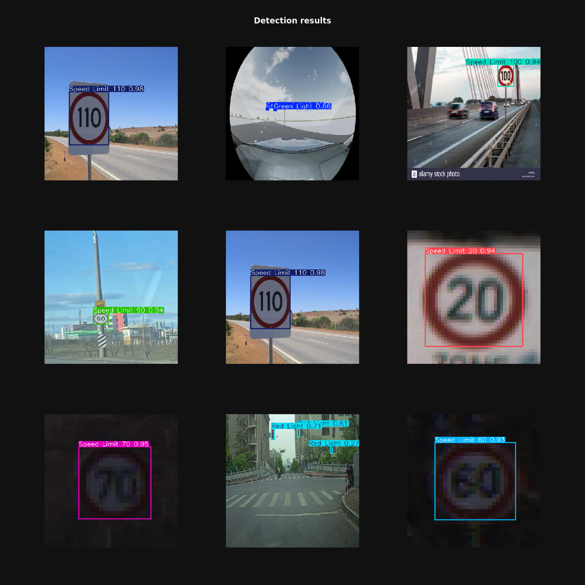

# <center>Traffic signs detection using YOLOv8</center>
Prediction example of trained model on images from test set.  


## Model overview
The nano version `yolov8n` was used as the base model. This model has the fewest parameters and is the **fastest during inference** compared to the rest of the *YOLOv8* family models.  
The training was conducted on 100 epochs

All training code can be found in notebook [<b>detection.ipynb</b>](detection.ipynb)

Trained weights can be downloaded from the [<b>Google Drive</b>](https://drive.google.com/file/d/1qquGfSj1MkDexq6Y0ccs1zHrCD0ClnsF/view?usp=drive_link)
## Dataset
The dataset used was the [<b>Traffic Signs Detection</b>](https://www.kaggle.com/datasets/pkdarabi/cardetection/data)

## Inference example
```python
from ultralytics import YOLO

model = YOLO("best.pt")
image_path = '$SET_YOUR_IMAGE_PATH$'

results = model.predict(source=image_path)
```